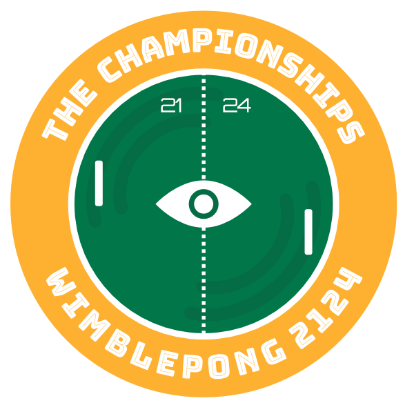

# WimblePong

  

## WimblePong

You can find Wimblepong [here](https://wimblepong.netlify.app) (chrome recommended) and train your models using [this notebook](./ai_training/README.md)

Any issues found please raise them on this repo.
